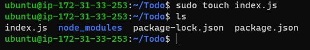

## SIMPLE TO-DO APPLICATION ON MERN WEB STACK

Before I started working, I updated my server by running command `sudo apt update` and afte updating the server, I upgraded it server as well by running command `sudo apt upgrade`

The images below displayed the output for server update and server upgrade respectively


# *Getting location of Node.js from ubuntu*

To get the location of NOde.js software from Ubuntu repositories, I run command `curl -fusSL https://deb.nodesource.com/setup_18.x | sudo -E bash -` and the output generated is shown in the image below:


After this had been done, I installed Node.js on the ubuntu server by running command `sudo apt-get install -y nodejs`. Morever, the command installed not only the node.js but also npm which is a package manager for Node just like apt for ubuntu. It is also being used for managing dependency conflicts. This image below displays the output of the installation.


To confirm node installation, I run command `node -v` or `sudo node -v` or `npm -v` or `sudo npm -v` and the outputs genarated are presented in the image below:


# *Application code setup*

To start this, I created a directory for olaniyi_Todo project by runnning command `sudo mkdir Todo` and I confirmed the creation of the olaniyi_Todo directory by running command `ls` and `ls -lih` and the details is shown in the image below:


After the directory has been confirmed and entrying the olaniyi_todo directory, I used command `npm init` to initialise the project in order for a new file called package.json can be created. Thus, the file contains the information about the application and the dependencies that it needs to run. See the below image for the output generated


To confirm package.json run ls command


## INSTALLING EXPRESSJS

To install expressjs, I run command `sudo npm install express` and the image below displays the out put generated


After this, I created index.js with command `sudo touch index.js` and I run ls command to confirm if it has been created. The output generated is shown below:



To install dotenv module, I run command `sudo npm install dotenv`. The outputbelow was generated


Later, I opened the index.js file with command `sudo vim index.js` and I entered the script below into it and saved it.
```

const express = require('express');
require('dotenv').config();

const app = express();

const port = process.env.PORT || 5000;

app.use((req, res, next) => {
res.header("Access-Control-Allow-Origin", "\*");
res.header("Access-Control-Allow-Headers", "Origin, X-Requested-With, Content-Type, Accept");
next();
});

app.use((req, res, next) => {
res.send('Welcome to Express');
});

app.listen(port, () => {
console.log(`Server running on port ${port}`)
});
```

To confirm that the server is working perfectly as expected, I run command `node index.js` and I got the image below as output


So, I edited my ec2 security group to allow port 5000 and then open my browser to check if my configuration is working well by inputting http://public-address:5000 and the output below was displayed


## ROUTES

I expect the To-Do application to perform the following three actions:
```
1. to create a new task;
2. to display list of all tasks; and 
3. to delete completed tasks
```

So, each task will be associtated with some particular endpoint and this will use different standard HTTP request methods including: POST, GET and DELETE. Also, routes that will  define various endpoints the To-do app will depend on will be created for each of the task. Therefore, I created a folder for routes using the command:
`sudo mkdir routes`

After creating directory for routes, I created a file called api.js inside it by running command `sudo touch api.js`. Then I opened the file with command `sudo vim api.js` and typed the code below into the output from it.

```
const express = require ('express');
const router = express.Router();

router.get('/todos', (req, res, next) => {

});

router.post('/todos', (req, res, next) => {

});

router.delete('/todos/:id', (req, res, next) => {

})

module.exports = router;
```

## MODELS

I created model for the To-Do app since it is going to make use of a NoSQL database called Mongodb. The model that will be created is going to make the app to be interactive. 

Furthermore, the model will be used to define database schema (*it represents the logical configuration of all or part of a relational database*) in order to define the fields stored in each Mongdb document. The database schema will determine how the database will be constructed.

To create the Schema and a model, I first installed mongoose which is a Node.js package that makes working with mongodb easier. So, I returned to the todo directory by running command `cd ..` and then installed mongoose with command `sudo npm install mongoose`. the image below showed the output of generated from mongoose installation.


After this, I created a new directory for models by running command `sudo mkdir models` and then enter into the directory by running command `cd models`. I then created a file inside the directory by running command `sudo touch todo.js`.

After creating the file, I opened it with command `sudo vim todo.js` and then typed the script below into it and saved.

```
const mongoose = require('mongoose');
const Schema = mongoose.Schema;

//create schema for todo
const TodoSchema = new Schema({
action: {
type: String,
required: [true, 'The todo text field is required']
}
})

//create model for todo
const Todo = mongoose.model('todo', TodoSchema);

module.exports = Todo;
```

After doing this, I cd into routes directory and opened it with command `sudo vim api.js` and then deleted the content in it with command `:%d` and typed the script below into it and saved it.

```
const express = require ('express');
const router = express.Router();
const Todo = require('../models/todo');

router.get('/todos', (req, res, next) => {

//this will return all the data, exposing only the id and action field to the client
Todo.find({}, 'action')
.then(data => res.json(data))
.catch(next)
});

router.post('/todos', (req, res, next) => {
if(req.body.action){
Todo.create(req.body)
.then(data => res.json(data))
.catch(next)
}else {
res.json({
error: "The input field is empty"
})
}
});

router.delete('/todos/:id', (req, res, next) => {
Todo.findOneAndDelete({"_id": req.params.id})
.then(data => res.json(data))
.catch(next)
})

module.exports = router;
```

## MONGODB DATABASE

To store all my data, I created a database on mLab which is platform provided by MongoDB. So, I created new cluster named olaniyi on the mLab.

In the index.js file I created, I specied process.env and it was not yet created. Therefore I created this by entering my Todo directory and created a file named .env by running command `touch .env` and I `vi` into the file and typed the code `DB ='mongodb+srv://olaniyi2oguns:<password>@olaniyi.bccfxjs.mongodb.net/?retryWrites=true&w=majority'` that I got from the olaniyi database created on the mLab.

After this had been done, I updated the content inside index.js file. To do this, I `vim` into the file and deleted the exisit file into with command `:%d` and the typed the following code into it.

```
const express = require('express');
const bodyParser = require('body-parser');
const mongoose = require('mongoose');
const routes = require('./routes/api');
const path = require('path');
require('dotenv').config();

const app = express();

const port = process.env.PORT || 5000;

//connect to the database
mongoose.connect(process.env.DB, { useNewUrlParser: true, useUnifiedTopology: true })
.then(() => console.log(`Database connected successfully`))
.catch(err => console.log(err));

//since mongoose promise is depreciated, we overide it with node's promise
mongoose.Promise = global.Promise;

app.use((req, res, next) => {
res.header("Access-Control-Allow-Origin", "\*");
res.header("Access-Control-Allow-Headers", "Origin, X-Requested-With, Content-Type, Accept");
next();
});

app.use(bodyParser.json());

app.use('/api', routes);

app.use((err, req, res, next) => {
console.log(err);
next();
});

app.listen(port, () => {
console.log(`Server running on port ${port}`)
});

```

So, I started my server by running command `node index.js` and the image below showed the output generated to show that database connected succesfully. as shown in the output display in the image below:


*Testing Backend Code Without Frontend Using RESTful API*

I am yet to create a fontend UI after I created the backend part of the application and the databased had been configured. Therefore, I used ReactJS to implement it; and to do this, I used API development client to test the code. So, I employed Postman application to test the code. The images below showed the output of the Post request and Get request I made on the postman application. Thus, this reflects that the backend part is supporting:
 
 1. the display of a list of task i.e the HTTP GET request
 2. add a new task to the list i.e HTTP POST request
 3. delete an existing task from the list i.e HTTP DELETE request


## CREATING FRONTEND

After I have achieved all the functionality  I want from the backend and the API, I created a user interface for a Web client (browser) so that it can interact with the application through the API. To achieve this, I rund command `npx create-react-app client` and the output generated was displayed in the images below:


*Running A Reacting App*

After the installation of the reacting app, I as well installed concurrently with command `npm install concurrently --save-dev` and nodemon with command `npm install nodemon --save-dev` and the outputs generate were displayed below respectively.


 
 In todo directory, opened package.json file by running command `vim package.json` and replaced the script:

```
"scripts": {
    "test": "echo \"Error: no test specified\" && exit 1"
}
```

 with

 ```

 "scripts": {
"start": "node index.js",
"start-watch": "nodemon index.js",
"dev": "concurrently \"npm run start-watch\" \"cd client && npm start\""
},
```


*Configuring the Proxy in package.json*

In order to ensure that the application can be accessed on the browser with a url like http://localhost:5000 instead of including the whole path like http://localhost:5000/api/todos, I and opened package.json file on client directory with `vi package.json` and added a key value pair `"proxy": "http://localhost:5000",`

I then cd back into Todo directory and run command `npm run dev`. The image below showed the output generated.


To ensure acces to the application from the internet, I opened port 3000 on my instance.

*Creating React Components*

To create a react component, I opened client directory and then entered the src directory and create compoents folder with command `mkdir components` and I created three different files, this include Input.js, ListTodo.js and Todo.js by use touch command.

I therefore, opened the Input.js file with command `vi Input.js` and typed the script below into it and saved:

```
import React, { Component } from 'react';
import axios from 'axios';

class Input extends Component {

state = {
action: ""
}

addTodo = () => {
const task = {action: this.state.action}

    if(task.action && task.action.length > 0){
      axios.post('/api/todos', task)
        .then(res => {
          if(res.data){
            this.props.getTodos();
            this.setState({action: ""})
          }
        })
        .catch(err => console.log(err))
    }else {
      console.log('input field required')
    }

}

handleChange = (e) => {
this.setState({
action: e.target.value
})
}

render() {
let { action } = this.state;
return (
<div>
<input type="text" onChange={this.handleChange} value={action} />
<button onClick={this.addTodo}>add todo</button>
</div>
)
}
}

export default Input
```

To make use of Axios (a promise based HTTP client for browser and node.js), I opened the client directory and run command `npm install axios` and the output below was generated 


After this, I opened components directory again and opened the ListTodo.js file and wrote the following script into it and saved.

```
import React from 'react';

const ListTodo = ({ todos, deleteTodo }) => {

return (
<ul>
{
todos &&
todos.length > 0 ?
(
todos.map(todo => {
return (
<li key={todo._id} onClick={() => deleteTodo(todo._id)}>{todo.action}</li>
)
})
)
:
(
<li>No todo(s) left</li>
)
}
</ul>
)
}

export default ListTodo
```


Thereafter, I opened Todo.js file and wrote the following script into it and saved.

```
import React, {Component} from 'react';
import axios from 'axios';

import Input from './Input';
import ListTodo from './ListTodo';

class Todo extends Component {

state = {
todos: []
}

componentDidMount(){
this.getTodos();
}

getTodos = () => {
axios.get('/api/todos')
.then(res => {
if(res.data){
this.setState({
todos: res.data
})
}
})
.catch(err => console.log(err))
}

deleteTodo = (id) => {

    axios.delete(`/api/todos/${id}`)
      .then(res => {
        if(res.data){
          this.getTodos()
        }
      })
      .catch(err => console.log(err))

}

render() {
let { todos } = this.state;

    return(
      <div>
        <h1>My Todo(s)</h1>
        <Input getTodos={this.getTodos}/>
        <ListTodo todos={todos} deleteTodo={this.deleteTodo}/>
      </div>
    )

}
}

export default Todo;
```


Later, I opened src folder and opened App.js file with command `vi App.js` and wrote the script below into it

```
import React from 'react';

import Todo from './components/Todo';
import './App.css';

const App = () => {
return (
<div className="App">
<Todo />
</div>
);
}

export default App;

```

Thereafter, I opened App.css file with command `vi App.css`and wrote the script below into it

```
.App {
text-align: center;
font-size: calc(10px + 2vmin);
width: 60%;
margin-left: auto;
margin-right: auto;
}

input {
height: 40px;
width: 50%;
border: none;
border-bottom: 2px #101113 solid;
background: none;
font-size: 1.5rem;
color: #787a80;
}

input:focus {
outline: none;
}

button {
width: 25%;
height: 45px;
border: none;
margin-left: 10px;
font-size: 25px;
background: #101113;
border-radius: 5px;
color: #787a80;
cursor: pointer;
}

button:focus {
outline: none;
}

ul {
list-style: none;
text-align: left;
padding: 15px;
background: #171a1f;
border-radius: 5px;
}

li {
padding: 15px;
font-size: 1.5rem;
margin-bottom: 15px;
background: #282c34;
border-radius: 5px;
overflow-wrap: break-word;
cursor: pointer;
}

@media only screen and (min-width: 300px) {
.App {
width: 80%;
}

input {
width: 100%
}

button {
width: 100%;
margin-top: 15px;
margin-left: 0;
}
}

@media only screen and (min-width: 640px) {
.App {
width: 60%;
}

input {
width: 50%;
}

button {
width: 30%;
margin-left: 10px;
margin-top: 0;
}
}
```
In addition, I opened index.css file with command `vi index.css` and wrote the script below into it

```
body {
margin: 0;
padding: 0;
font-family: -apple-system, BlinkMacSystemFont, "Segoe UI", "Roboto", "Oxygen",
"Ubuntu", "Cantarell", "Fira Sans", "Droid Sans", "Helvetica Neue",
sans-serif;
-webkit-font-smoothing: antialiased;
-moz-osx-font-smoothing: grayscale;
box-sizing: border-box;
background-color: #282c34;
color: #787a80;
}

code {
font-family: source-code-pro, Menlo, Monaco, Consolas, "Courier New",
monospace;
}
```

I then returned back to Todo directory and run command `npm run dev` and the output in the images below was generated.


